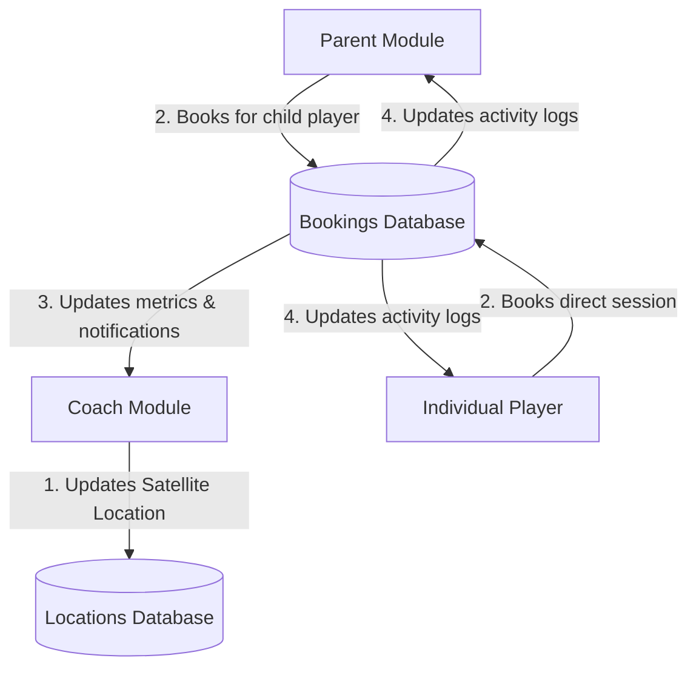

# Arenova App - Architecture & Flow Understanding

This document outlines the architecture, roles, operational flows, and data privacy boundaries of the Arenova application. Please add comments or notes directly under the sections to outline any additions or changes you want to make.

---

## 1. The Three Modules (Roles)

### Coach Module (`(coach)`)
* **Role**: Service Provider.
* **Core Functions**:
  * Manage coaching locations (using the Google Maps Satellite Picker).
  * Configure session availability, training schedules, and pricing.
  * Track client profiles and booked session histories.
  * Monitor earnings and deactivations inside the coach wallet.
  * Configure preferences (Sound, Vibration, notifications).

### Individual User Module (`(individual)`)
* **Role**: Direct training participant (Athlete/Player).
* **Core Functions**:
  * Search and view coaches list (filtered dynamically by the coach's configured schedule/availability).
  * Book training sessions and make payments.
  * View personal training activity, statistics, and schedule.

### Parent Module (`(parent)`)
* **Role**: Manager & Guardian.
* **Core Functions**:
  * Search and view coaches list (filtered dynamically by availability/schedule for managing child bookings).
  * Manage child accounts linked under their **Family Tree**.
  * Book sessions on behalf of specific child players.
  * Track statistics, logs, and billing for all child accounts.

---

## 2. Operational Flow & Interlinkages

### Flow Walkthrough:
1. **Location Setting**: The coach sets their active location. This is stored in the database.
2. **Coach Lookup**: Individual players or parents search for coaches, view profiles, and load the live location on Google Maps.
3. **Session Booking**: A player or parent books a slot and makes a payment. The booking is written to the database.
4. **Dashboard Synchronization**: The coach dashboard queries booking records, updating session metrics and scheduling logs immediately.
5. **Real-time Notifications**: Backend notifications alert all linked parties (the coach, the parent, and the child player).

---

## 3. Data Privacy & Operational Boundaries

To protect user privacy and separate individual records, data is restricted across three boundaries:

### A. UI Routing Isolation
* The Expo Router directories (`(coach)`, `(individual)`, `(parent)`) segment layouts. A coach cannot view parent management features or other players' stats.

### B. Role-Based Backend Access Control
* Every API request carries a JWT authentication token. The backend verifies the user's role before processing actions (e.g., verifying `role === 'coach'` for location CRUD operations).

### C. Context-Scoped Shared Flows (`(shared)`)
* Reusable workflows (like Payments, Review Player, Select Player) are placed in the `(shared)` directory, but their data queries are restricted:
  * **Parents** can only view coordinates, payments, and notifications linked to children registered in their Family Tree.
  * **Individual Users** can only view notifications and activity logs belonging to their account.
  * **Coaches** can only access records of clients who have booked sessions with them.

---

### User Comments & Feedback:
*Please write your notes, updates, or API endpoint requirements below:*
* 
